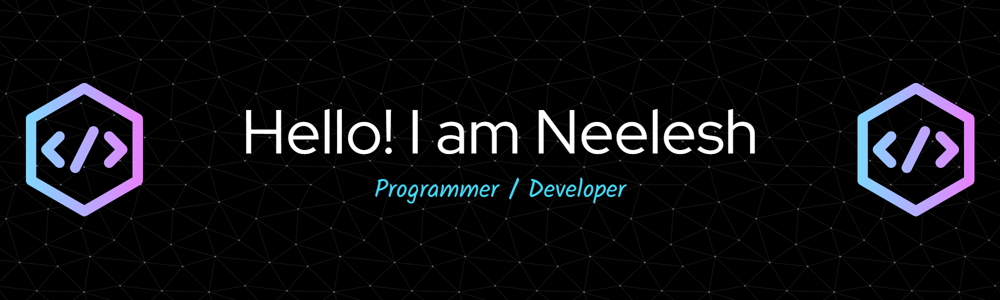

<h1 align="center">Hi 👋, I'm Neelesh Kumar Rana</h1>
<h3 align="center">A passionate frontend developer from India</h3>

  

- 🔭 I’m currently working on **WEB DEVELOPMENT**

- 🌱 I’m currently learning **React, Java** 

- 💬 Ask me about **C,C++,HTML,CSS,Python**

- 📫 How to reach me **neeleshrana22@gmail.com**

- ⚡ Fun fact **I am funny**

<h3 align="left">Connect with me:</h3>

<h3 align="left">Languages and Tools:</h3>

          

