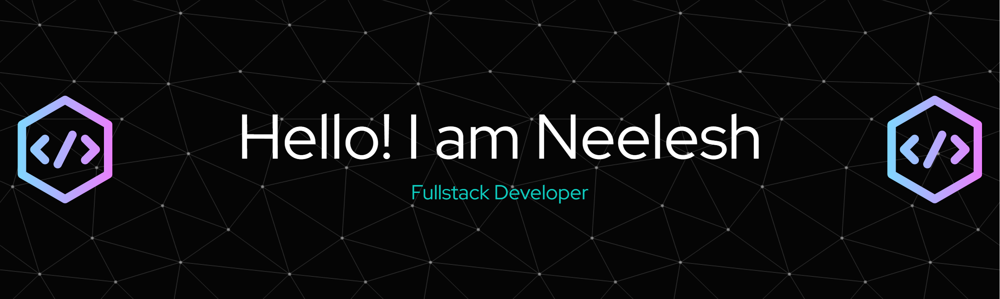

<h1 align="center">
  
</h1>

  

### 👨‍💻 About Me

💻 Full Stack Developer | MERN Stack & TypeScript Enthusiast  
🌱 Currently learning: Advanced Next, Prisma, PostgreSQL, and Web3  
🏆 Active in hackathons: Smart India Hackathon, HackDotSlash, and more  
🧠 DSA in C++  
🎯 Tech event organizer & society vice president    
📬 Reach me: neeleshrana22@gmail.com

---

### 🛠️ Tech Stack

#### 🧠 Languages

#### 🎨 Frontend

#### 🔧 Backend & DB

#### 🌐 Web3

#### ⚙️ Tools & Platforms

---

### 🌐 Coding Profiles

  
<!--    -->
  
<!--    -->
<!--    -->

---

### 📊 GitHub Stats

  
  

---

